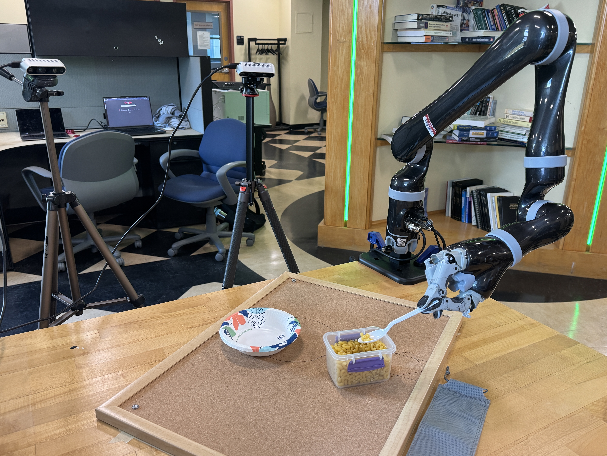
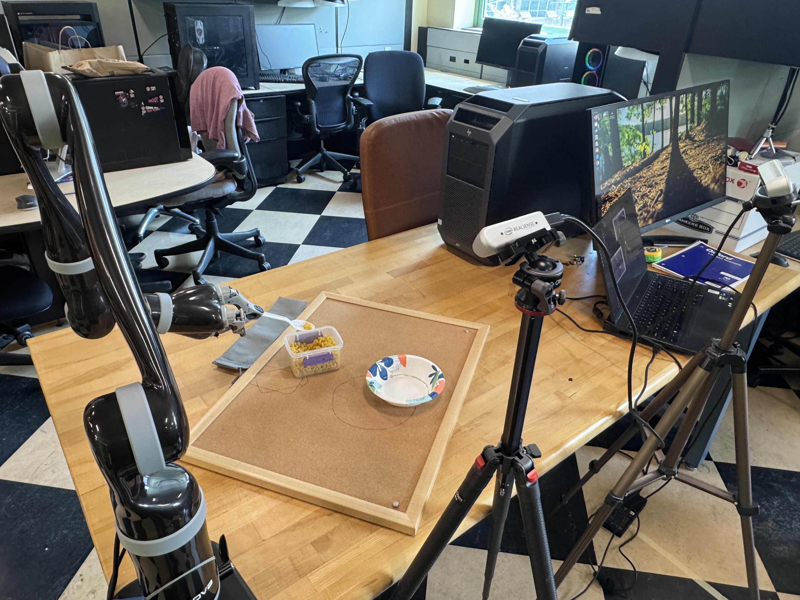
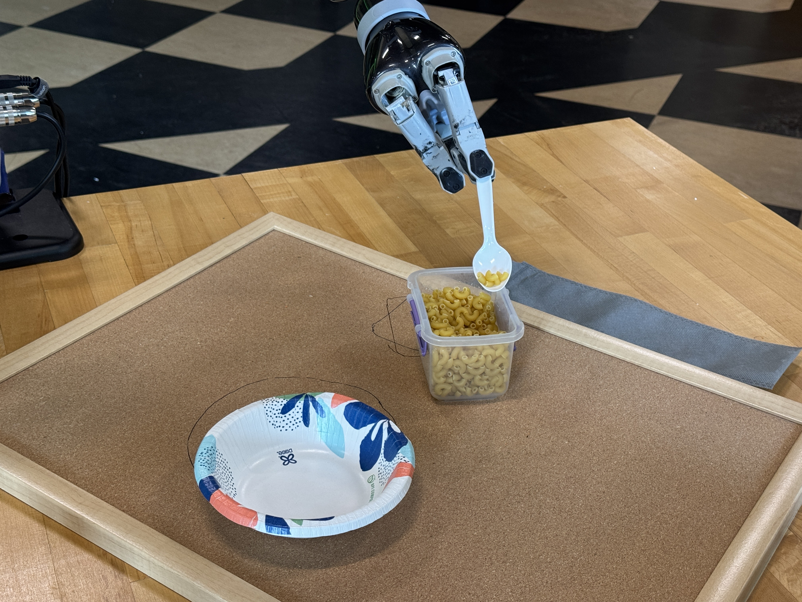
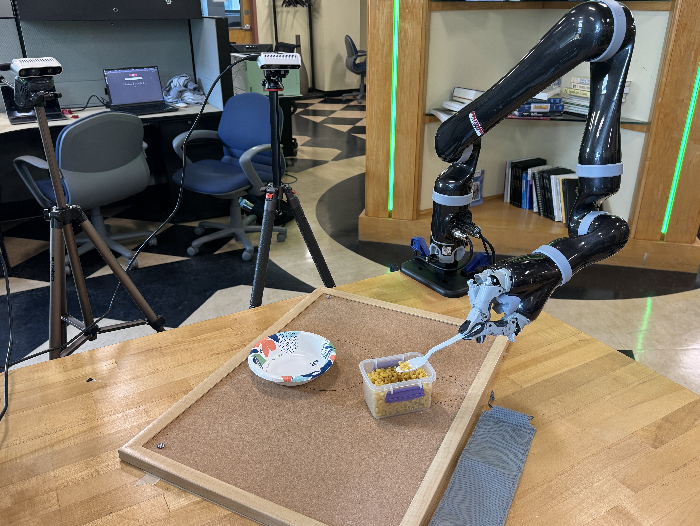

# Tool-as-Interface Pipeline

> Adapted from [Tool-as-Interface](https://github.com/Tool-as-Interface/Tool_as_Interface) (Chen et al., UIUC & Columbia).

A modular re-implementation of the Tool-as-Interface imitation learning pipeline. Provide any tool as a 3D mesh and a text prompt — no code changes required.

---

## Physical setup

| | |
|---|---|
|  |  |
| *Full setup: Kinova Jaco2 6DOF arm, two Intel RealSense D435 cameras on tripods, corkboard task workspace* | *Workspace detail: task-frame corkboard, pasta source container, target bowl, and RealSense camera* |
|  |  |
| *Close-up: Jaco2 gripper holding spoon, scooping elbow pasta from container* | *Wide view: robot executing the pastaTransfer task — scoop from box, transfer to bowl* |

**Hardware:**
- **Robot:** Kinova Jaco2 6DOF spherical-wrist arm (USB SDK)
- **Cameras:** 2× Intel RealSense D435 (848×480, 30fps RGBD)
- **Task:** pasta transfer — scoop elbow pasta from a container into a bowl

---

## Architecture

**Diffusion policy** (DDPM, 100 denoising steps):

| Component | Details |
|---|---|
| Image encoder | Shared ResNet-18 (ImageNet pretrained) |
| Multi-view fusion | Concatenate per-step features across `n_views` cameras, then project |
| Observation context | `n_obs_steps=2` consecutive timesteps, each with `n_views` images + proprioception |
| Noise predictor | Temporal **UNet-1D** (Chi et al. 2023) with GroupNorm + Mish + FiLM conditioning |
| Default UNet dims | `(128, 256, 512)` — ~30M total params |
| Action representation | 9D = 3D translation (m) + 6D rotation (first two cols of R, flattened) |
| Action horizon | 16 steps |
| Execution horizon | 8 steps (receding horizon, async inference) |

**Control frequency consistency** — this must be set consistently across training and deployment:

```
record_fps / subsample = deploy_hz

Examples:
  30 fps, subsample=3  →  10 Hz  (recommended baseline)
  30 fps, subsample=2  →  15 Hz
```

Set `--subsample` in step 5 and `--frequency` in step 7 to the same Hz value. The action horizon and execution horizon are measured in control steps, so 16 steps at 10 Hz = 1.6 s prediction window, 8 steps = 800 ms execution window.

---

## Pipeline overview

```
Step 0:   00_calibrate.py          — camera extrinsics (ChArUco board)
Step 0b:  06_calibrate_robot.py    — robot base frame relative to task frame
Step 0c:  check_tool_eef_error.py  — calibrate T_tool_eef (tool→EEF rigid offset)

Step 1:   01_record.py             — record demonstrations (all cameras, RGBD) [--auto_track fuses in steps 3-4]
Step 2:   02_augment_noposplat.py  — novel-view augmentation [OPTIONAL — skip with --cam_only in step 3]
Step 3:   03_segment.py            — mask human hands/arms
Step 4:   04_track.py              — 6DOF tool tracking (FoundationPose)
Step 4b:  04b_to_task_frame.py     — [standalone] re-transform cam→task frame
Step 4c:  04c_to_base_frame.py     — [standalone] re-transform task→robot base frame
Step 5:   05_train.py              — train diffusion policy (human-demo images)
Step 5r:  05_train_replay.py       — [ALTERNATE] train on REPLAY images instead, with optional --val_episodes (pair with 07_deploy.py --no_arm_mask)
Step 7:   07_deploy.py             — live inference on the real robot
```

**Action/proprio coordinate frame:** controlled by `05_train.py --action_frame` (`task` (default), `base`, or `cam`) — NOT a fixed "preferred frame with fallback" as older wording here used to say. `07_deploy.py` reads whichever frame the loaded checkpoint was trained with directly from the checkpoint, so training and deployment stay consistent automatically regardless of which you pick. Default (`task`) is recommended: it defers the `T_base_task` conversion to deploy time, so a later robot-base recalibration improves an already-trained policy for free, rather than requiring a retrain.

---

## Setup

```bash
source ~/miniconda3/etc/profile.d/conda.sh && conda activate ti
```

### Installation

Expected workspace layout:
```
tool-as-interface/
    pipeline/                  ← this directory
    Tool_as_Interface/
        third_party/
            FoundationPose/
            Grounded-Segment-Anything/
    Depth-Anything-V2/         ← optional, for fallback depth maps
```

```bash
# 1. Create environment
conda create -n ti python=3.10 -y && conda activate ti

# 2. PyTorch (CUDA 11.8)
pip install torch==2.0.0+cu118 torchvision==0.15.2+cu118 torchaudio==2.0.1+cu118 \
    --extra-index-url https://download.pytorch.org/whl/cu118

# 3. Core dependencies
pip install pyrealsense2 groundingdino-py trimesh nvdiffrast open3d \
    opencv-contrib-python diffusers==0.20.1 accelerate pillow \
    numpy==1.26.4 scipy tqdm einops roma kornia timm \
    segmentation-models-pytorch plotly

# 4. segment_anything
pip install -e Tool_as_Interface/third_party/Grounded-Segment-Anything/segment_anything

# 5. FoundationPose
pip install -r Tool_as_Interface/third_party/FoundationPose/requirements.txt

# 6. NoPoSplat (step 2, optional)
git clone https://github.com/cvg/NoPoSplat ~/working_dir/NoPoSplat
pip install gsplat hydra-core omegaconf huggingface_hub "e3nn==0.5.1"
# Note: use e3nn==0.5.1 specifically — newer versions break the CUDA 11.8 environment
```

### Model checkpoints

All weights go in `pipeline/checkpoints/`.

```bash
# GroundingDINO
wget -P checkpoints \
    https://github.com/IDEA-Research/GroundingDINO/releases/download/v0.1.0-alpha/groundingdino_swint_ogc.pth

# SAM ViT-H
wget -P checkpoints \
    https://dl.fbaipublicfiles.com/segment_anything/sam_vit_h_4b8939.pth
```

**FoundationPose** — download from [HuggingFace](https://huggingface.co/bowen-wen/FoundationPose):
```
checkpoints/foundation_pose_weights/
    2023-10-28-18-33-37/model_best.pth   ← scorer
    2024-01-11-20-02-45/model_best.pth   ← refiner
```

**Depth Anything V2** (optional, step 2 fallback):
`Depth-Anything-V2/metric_depth/checkpoints/depth_anything_v2_metric_hypersim_vitl.pth`

---

## Full pipeline walkthrough

### Step 0 — Camera calibration (`00_calibrate.py`)

Place the ChArUco board flat on the table in the task workspace. Run once per camera, once per camera placement.

```bash
python 00_calibrate.py --camera 0 --output data/cam_extrinsics.npy
python 00_calibrate.py --camera 1 --output data/cam1_extrinsics.npy
```

| Argument | Default | Description |
|---|---|---|
| `--output` | `data/cam_extrinsics.npy` | Output path for the 4×4 world→cam matrix |
| `--camera` | `0` | RealSense camera index |
| `--n_stable` | `5` | Number of stable detections to average |

**Checking whether a camera has drifted, without recalibrating:** `check_camera_extrinsics_drift.py`
re-detects the board and compares the fresh pose against the saved `.npy`, without overwriting it —
useful after bumping a tripod, or as a periodic sanity check.

```bash
python check_camera_extrinsics_drift.py               # checks cam0 and cam1
python check_camera_extrinsics_drift.py --track_cam 1  # just cam1
```
Reports translation (cm) / rotation (deg) drift per camera and flags "LIKELY MOVED" past
1cm / 1.5° (tunable via `--trans_warn_cm` / `--rot_warn_deg`). Saves a side-by-side comparison
snapshot (`data/cam{N}_drift_check.jpg`: old calibration in thin gray, fresh detection in bold
color) so you can visually confirm before deciding whether to recalibrate.

If a camera did drift and you recalibrate it with `00_calibrate.py`: `robot_extrinsics*.npy` does
NOT need to be redone (see the note in Step 0b), but `T_tool_eef`/`T_eef_spoon` (Step 0c) DOES,
if it was calibrated using that camera — the vision chain it was fit against has changed.

---

### Step 0b — Robot base frame calibration (`06_calibrate_robot.py`)

Jog the robot to four known board points and press SPACE at each. Run once per camera/robot placement.

```bash
# Standard calibration (uses GetCartesianPosition)
python 06_calibrate_robot.py --output data/robot_extrinsics.npy

# Live preview from a specific camera (e.g. cam1, if the robot base is
# better framed by that camera than cam0)
python 06_calibrate_robot.py --output data/robot_extrinsics.npy --track_cam 1
```

`06_calibrate_robot.py`'s Z estimate (from `GetCartesianPosition`) has a systematic bias — see the
correction workflow immediately below, which is now the recommended fix. Always run that workflow
after this step; don't ship the raw `06_calibrate_robot.py` output as `--robot_extrinsics`.

`--use_joint_fk` (joint-angle FK instead of GCP) exists as an alternative Z source but is
**superseded** by the Z-correction workflow below, which is more accurate (verified against a
direct ruler measurement, not just a different estimator prone to its own biases) — don't use
`--use_joint_fk` for new calibrations.

| Argument | Default | Description |
|---|---|---|
| `--output` | `data/robot_extrinsics.npy` | Output path for 4×4 T\_base\_task |
| `--camera` / `--track_cam` | `0` | RealSense camera index for the live touch-point overlay |
| `--use_joint_fk` | off | **Superseded** — see Z-correction workflow below |

#### Correcting Z when touching with a probe/stick, and the ~4.5cm GCP bias

`06_calibrate_robot.py` records `GetCartesianPosition()` at each touch — it has no notion of a
probe/stick extending past the gripper. Two independent calibration sessions (2026-06-21/22 and
2026-07-06, different tools) both found the resulting Z off by the same **~4.4-4.5cm**, which
means it's a **systematic bias**, not touch imprecision: `GetCartesianPosition()`'s reference
point sits ~4.4cm *behind* the physical Kinova fingertips, not at them. XY translation and yaw
were never observed to be affected — the Kabsch fit mean-centers before solving rotation, so any
*constant* offset (a probe held at the same orientation every touch) washes out of the rotation
fit and only shows up as a Z error.

**The robust fix — skip touch-based Z, use a direct ruler measurement instead.** None of the
scripts below modify `06_calibrate_robot.py`; they post-process its output.

```bash
# 1. Calibrate as usual. If you used a probe/stick (not a bare fingertip),
#    keep the wrist orientation IDENTICAL across all 4 touches (approach
#    from directly above, translate only in XY, never rotate between
#    points) — required for the correction below to be valid.
python 06_calibrate_robot.py --output data/robot_extrinsics.npy

# 2. [Only if you touched with a probe/stick] subtract its measured length
#    (from the Kinova fingertips to the stick's tip, in cm):
python correct_robot_extrinsics_stick_offset.py \
    --input data/robot_extrinsics.npy --stick_length_cm 18.0
    # -> data/robot_extrinsics_stick_corrected.npy

# 3. Override Z with a direct measurement: how far BELOW the robot base
#    mounting plate the ChArUco board plane sits (ruler/caliper, cm).
#    XY translation and yaw are kept from the touch-based fit.
python override_robot_base_z.py \
    --input data/robot_extrinsics_stick_corrected.npy --board_below_base_cm 5.3
    # -> data/robot_extrinsics_stick_corrected_zmeasured.npy

# 4. Sanity-check visually — works with any T_base_task file, any camera:
python visualize_robot_base_in_camera.py \
    --T_base_task data/robot_extrinsics_stick_corrected_zmeasured.npy --track_cam 1
```

Use the resulting `..._zmeasured.npy` file as `--robot_extrinsics` everywhere downstream
(`calibrate_tool_eef.py`, `04c_to_base_frame.py`, `07_deploy.py`). Skip step 2 if you touched
the board with a bare/negligible-length tip rather than a stick — go straight from step 1's
output into step 3.

**To redo this later** (new camera/robot placement, or a different probe): repeat steps 1-4
above with the new stick length / measured height. The systematic ~4.4cm GCP-to-fingertip gap
is a property of this specific Kinova arm/SDK, not of any one session, so expect the same
correction to be necessary every time you recalibrate with the touch procedure.

**Note — this calibration does NOT depend on the cameras.** `T_base_task` is derived entirely
from touching physical board points plus a direct ruler measurement; no camera extrinsics enter
into it. If a camera drifts (see the drift check in Step 0) and you recalibrate it, `T_base_task`
stays valid as long as the ChArUco board itself hasn't physically moved — you do NOT need to
redo this workflow just because a camera was recalibrated. (You DO need to redo Step 0c —
`T_tool_eef`/`T_eef_spoon` — if it was calibrated using the camera that moved.)

---

### Step 0c — T\_tool\_eef calibration (`check_tool_eef_error.py`)

Calibrates the rigid offset between tool frame (FoundationPose) and robot EEF frame. Run once per tool grasp configuration.

**Procedure:**
1. Place the tool on the table (not in the gripper yet).
2. Launch: `python check_tool_eef_error.py --mesh spoon.obj --tool_prompt "spoon"`
3. Verify the bounding box wraps the tool — press **SPACE** to re-register if needed.
4. Pick up the tool with the gripper.
5. Once gripped, press **C** to capture and save `T_tool_eef`.
6. Verify error < 2 cm / < 5°. Press **Q** to quit.

| Argument | Default | Description |
|---|---|---|
| `--mesh` | required | Tool mesh (.obj) |
| `--tool_prompt` | required | GroundedSAM prompt |
| `--task_frame` | `data/cam_extrinsics.npy` | Camera extrinsics |
| `--robot_extrinsics` | `data/robot_extrinsics.npy` | Robot extrinsics — pass the Z-corrected `..._zmeasured.npy` from Step 0b, not the raw default |
| `--tool_eef_cache` | `data/T_tool_eef.npy` | Save path |
| `--camera` | `0` | RealSense camera index |

**More robust alternative — `calibrate_tool_eef.py`:** the single `C`-key capture above is one
FoundationPose frame, so it's noisy. `calibrate_tool_eef.py` collects the same closed-form
estimate at many jogged poses (vary position *and* orientation) and robustly averages them
(per-capture burst averaging, SVD-based rotation averaging, one outlier-rejection pass), and
optionally jointly refines `T_base_task` alongside `T_tool_eef` from the same data. It also
writes a `T_eef_spoon`-equivalent sidecar so `07_deploy.py`/`replay_episode.py` (which prefer
`T_eef_spoon.npy` over `T_tool_eef.npy` whenever present) pick up the improved calibration:

```bash
python calibrate_tool_eef.py --mesh spoon.obj --tool_prompt "spoon" --update_eef_spoon
```
Controls: SPACE re-register, C capture (hold still ~1s), F finish, Q quit without saving. See
the script's docstring for the full argument list and the joint-refinement diagnostics it prints.

---

### Step 1 — Record demonstrations (`01_record.py`)

```bash
python 01_record.py --task pastaTransfer --episode 001 --duration 15 \
    --mesh spoon.obj --tool_prompt "spoon"
```

| Key | Action |
|---|---|
| SPACE | Re-register FoundationPose on current frame |
| ENTER | Start recording |
| Q | Stop / abort |

| Argument | Default | Description |
|---|---|---|
| `--task` | `task` | Task name |
| `--episode` | `001` | Episode ID |
| `--duration` | `15.0` | Recording duration (seconds) |
| `--fps` | `30` | Frame rate |
| `--width` / `--height` | `848` / `480` | Resolution |
| `--mesh` | `None` | Tool mesh — enables FP overlay |
| `--tool_prompt` | `"tool"` | GroundedSAM prompt |

**Output:**
```
data/episodes/<task>/<episode>/
    cam0/           ← JPEG frames (000000.jpg …)
    cam1/
    cam0_depth/     ← 16-bit PNG depth (mm)
    cam1_depth/
    meta.json
```

**Fusing recording + tracking (`--auto_track`):** skips straight to Step 4c, tracking each episode
immediately after it's recorded instead of as a separate later pass over the whole task directory:

```bash
python 01_record.py --task pastaTransfer --episode 001 --duration 15 \
    --mesh spoon.obj --tool_prompt "spoon" --track_cam 1 --auto_track
```

Runs accurate offline FoundationPose tracking (`--auto_track_refine_iter 5`,
`--auto_track_est_refine_iter 8` by default — deliberately higher quality than the live-preview
overlay, which stays cheap/fast to keep up with 30fps capture and was found to cause severe drift
if reused for the saved trajectory on long clips) immediately after recording, reusing the
already-loaded FP/GDINO/SAM models. Always tracks RAW frames — never `masked_real/` — since
masked tracking was found to silently freeze near occlusion (see Known issues below), so **Step 3
is skipped entirely** for auto-tracked episodes. Also runs `visualize_poses.py` automatically
afterward (pass `--skip_auto_visualize` to skip) so you can immediately sanity-check the result —
always spot-check a few episodes, looking at frames across the *whole* clip, before trusting a
large batch. Saves the same `tool_poses_cam{N}.npz` / `tool_poses_task.npz` Step 4 would.

---

### Step 2 — Novel-view augmentation (`02_augment_noposplat.py`) [OPTIONAL]

Skip this step if using `--cam_only` in step 3 (single/dual real camera only, no rendered views).

```bash
python 02_augment_noposplat.py \
    --task_dir data/episodes/pastaTransfer \
    --noposplat_root ~/working_dir/NoPoSplat \
    --num_novel_views 6 --sample_every 1 --skip_done
```

| Argument | Default | Description |
|---|---|---|
| `--task_dir` | — | Task directory |
| `--num_novel_views` | `6` | Novel views per timestep |
| `--sample_every` | `15` | Process every Nth frame |
| `--skip_done` | off | Skip episodes already done |

**Output per episode:** `augmented/real/`, `augmented/novel/`, `augmented/novel_cameras.npz`

---

### Step 3 — Mask human hands/arms (`03_segment.py`)

Two modes:

**A. Camera-only (no step 2 needed) — recommended:**
```bash
python 03_segment.py \
    --task_dir data/episodes/pastaTransfer \
    --cam_only \
    --unet_checkpoint human_hand_segmentation_UNET/unet_best.pt \
    --skip_done
```

**B. With novel views (requires step 2):**
```bash
python 03_segment.py --task_dir data/episodes/pastaTransfer --skip_done
```

| Argument | Default | Description |
|---|---|---|
| `--cam_only` | off | Read directly from `camN/` dirs; write `masked_real/XXXXXX_camN.jpg` |
| `--unet_checkpoint` | `None` | Use trained hand-segmentation UNet instead of GroundedSAM2 (much faster) |
| `--unet_threshold` | `0.5` | Sigmoid threshold for UNet predictions |
| `--prompt` | `"human hand . human arm . person"` | GroundingDINO prompt (when not using UNet) |
| `--skip_done` | off | Skip episodes with existing `masked_real/` |

**Output per episode:** `augmented/masked_real/XXXXXX_camN.jpg`

---

### Step 4 — Track tool pose (`04_track.py`)

```bash
python 04_track.py \
    --task_dir data/episodes/pastaTransfer \
    --mesh spoon.obj --tool_prompt "spoon" \
    --track_cam 1 \
    --use_masked \
    --skip_done
```

`--use_masked` feeds the hand-blacked-out frames (`masked_real/`) to FoundationPose for RGB input, while keeping raw depth. Recommended when the human hand occludes the tool during demonstrations.

| Argument | Default | Description |
|---|---|---|
| `--mesh` | required | Tool mesh (.obj or .ply) |
| `--tool_prompt` | `"hammer"` | Text prompt for initial segmentation |
| `--track_cam` | `0` | Camera index for RGBD tracking |
| `--use_masked` | off | Use `masked_real/` frames for RGB (depth stays raw) |
| `--est_refine_iter` | `5` | Initial registration iterations |
| `--track_refine_iter` | `2` | Per-frame tracking iterations |
| `--skip_done` | off | Skip episodes with existing `tool_poses.npz` |
| `--task_frame` | auto | Path to cam extrinsics. Defaults to `data/cam{N}_extrinsics.npy` |

**Output per episode:**
```
augmented/
    tool_poses_cam{N}.npz     ← tracked poses in camera frame
    tool_poses_task.npz       ← poses in task/world frame (cam extrinsics applied)
```

**Verify tracking quality:**
```bash
python visualize_poses.py \
    --episode_dir data/episodes/pastaTransfer/001 \
    --mesh spoon.obj --use_real --camera 1 --use_masked
```

---

### Step 4b / 4c — Optional standalone transforms

These are only needed if re-transforming existing poses without re-running step 4.

```bash
# cam → task frame
python 04b_to_task_frame.py --task_dir ... --task_frame data/cam1_extrinsics.npy

# task → robot base frame (RECOMMENDED before training)
python 04c_to_base_frame.py --task_dir ... \
    --robot_extrinsics data/robot_extrinsics_stick_corrected_zmeasured.npy
```

Step 4c output (`tool_poses_base.npz`) is preferred by step 5 because the robot base frame is fixed relative to the robot regardless of camera placement.

---

### Step 5 — Train diffusion policy (`05_train.py`)

```bash
python 05_train.py \
    --data_dir data/episodes/pastaTransfer \
    --output_dir data/checkpoints/pastaTransfer \
    --track_cam 1 \
    --n_views 2 \
    --action_horizon 16 \
    --subsample 3 \
    --num_epochs 3050
```

**Frame rate:** `--subsample` must satisfy `record_fps / subsample = deploy_hz`. With 30fps recording and 10Hz deployment, use `--subsample 3`.

| Argument | Default | Description |
|---|---|---|
| `--data_dir` | required | Task directory |
| `--output_dir` | `data/checkpoints` | Checkpoint output |
| `--track_cam` | `0` | Camera used in step 4 (determines which cam is primary) |
| `--n_views` | `1` | Cameras per obs step. `1` = single cam (random pool). `2` = dual cam (always track_cam + one other) |
| `--subsample` | `1` | Use every Nth frame. Set to `record_fps / deploy_hz` |
| `--action_horizon` | `16` | Predicted action steps |
| `--n_obs_steps` | `2` | Observation context steps |
| `--unet_dims` | `128 256 512` | UNet-1D channel sizes per encoder stage |
| `--unet_kernel` | `5` | UNet-1D Conv1d kernel size |
| `--num_epochs` | `3050` | Training epochs |
| `--batch_size` | `32` | |
| `--lr` | `1e-4` | |
| `--image_size` | `128` | Resize before crop |
| `--crop_size` | `115` | Random crop size |
| `--checkpoint_every` | `100` | Save checkpoint every N epochs |
| `--action_frame` | `task` | Coordinate frame for action targets: `task` (ChArUco board — default), `base` (robot base), or `cam`. Note: despite older wording in this file's docstring, the actual default is `task`, not `base` — `07_deploy.py` reads whichever frame the checkpoint was trained with directly from the checkpoint, so training and deployment always stay consistent regardless of which you pick. `task` is recommended: it defers the `T_base_task` conversion to deploy time, so a later robot-base recalibration improves an already-trained policy for free, instead of requiring a retrain. |

**Confirmed 10Hz-consistent:** `--subsample 3` here (30fps / 3 = 10Hz) pairs with `07_deploy.py`'s default `--frequency 10` — both scripts document this exact relationship and there's no mismatch.

**Training on REPLAY images instead (`05_train_replay.py`):** if you've replayed episodes on the
robot (`replay_episode.py --execute --capture_camera`) and generated novel views from those replay
frames (`02_augment_noposplat.py --episode_dir <episode_dir>/replay`), you can train on those
**unmasked** replay images instead of the masked human-demo images. Rationale: replay images
already show the robot's own gripper doing the task — the same thing deployment's live camera
sees — so there's no human hand to mask out, potentially shrinking the train/deploy visual gap.
This is a separate script, not a flag on `05_train.py` — it reuses that file's `parse_args()`,
model construction, and checkpoint-saving (`_save`) unchanged (loaded as a module, nothing in that
file is modified), but has its own training loop so it can additionally track validation loss
(see below) — something the shared `train()` function doesn't support:

```bash
python 05_train_replay.py \
    --data_dir data/episodes/PastaTransfer_force \
    --output_dir data/checkpoints/PastaTransfer_force_replay \
    --track_cam 1 --subsample 3 --action_frame task --val_episodes 020
```

Same arguments as `05_train.py` otherwise. One thing to get right: **`--subsample` here must
match whatever `--subsample` was used at replay time** (default 3) — replay images only exist at
the frame_ids that became waypoints (e.g. 0, 3, 6, ...), not a dense sequence, so a mismatched
`--subsample` here means most requested frames won't exist and get silently dropped as incomplete
windows.

Action/proprio labels are unchanged either way — they still come from the original demo's tracked
trajectory (`tool_poses_*.npz`), since that's the only place pose labels exist; only the
observation *images* change. **Pair this with `07_deploy.py --no_arm_mask`** (Step 7) — a policy
trained on unmasked images should also be deployed on unmasked live images, since masking live but
training unmasked (or vice versa) is a train/deploy mismatch.

**Validation split (`--val_episodes`):** holds the given episode ID(s) out of training entirely
and tracks validation loss alongside training loss every 10 epochs — the actual signal for
overfitting (training loss alone keeps dropping even as a model overfits; validation loss
plateauing/rising while training loss keeps falling is the tell). The validation set reuses the
training set's normalizer rather than fitting its own (required for a meaningful loss comparison —
an independently-fit normalizer from 1-2 episodes would put val losses on a different scale).
Early stopping switches to watching validation-loss EMA once a validation split is given, instead
of `05_train.py`'s original training-loss EMA (a more standard, more correct overfitting signal).
With 20 episodes (~2660 windows total, ~2GB of replay images), holding out 1 leaves ~2527 for
training and ~133 for validation.

---

### Step 7 — Deploy on robot (`07_deploy.py`)

**Dry run (no robot motion — always start here):**
```bash
python 07_deploy.py \
    --checkpoint data/checkpoints/pastaTransfer/policy_final.pt \
    --unet_checkpoint robot_segmentation_UNET/training/checkpoints/best_model.pth \
    --track_cam 1 \
    --frequency 10 \
    --exec_steps 16
```

**Live execution (recommended full command):**
```bash
python 07_deploy.py \
    --checkpoint data/checkpoints/pastaTransfer4/policy_final.pt \
    --unet_checkpoint robot_segmentation_UNET/training/checkpoints/best_model.pth \
    --exec_steps 16 --frequency 10 \
    --robot_extrinsics data/robot_extrinsics_stick_corrected_zmeasured.npy \
    --robot_extrinsics_proprio data/robot_extrinsics_stick_corrected_zmeasured.npy \
    --max_trans_step 0.05 --max_rot_step_deg 20 \
    --arm_trans_speed 0.20 \
    --execute --wait_convergence
```

**Step-by-step mode (manual inspection):**
```bash
python 07_deploy.py ... --execute --wait_convergence --step_mode
# SPACE = send next action, P = pause, Q = quit
```

**Async inference design:** inference runs in a background thread. It fires when ≤2 actions remain in the queue, giving `2 / frequency` seconds of runway (200 ms at 10 Hz) for the next inference to complete. Observations are captured continuously during robot motion — not from a stopped robot.

**`--wait_convergence` and arm speed:** The Kinova Jaco2 USB SDK defaults to a very slow internal speed (~3 cm/s effective). Pass `--arm_trans_speed 0.15–0.25` to explicitly command a faster speed (`LimitationsActive=1`). The convergence timeout scales adaptively with the commanded move distance.

| Argument | Default | Description |
|---|---|---|
| `--checkpoint` | required | `policy_final.pt` from step 5 |
| `--unet_checkpoint` | required unless `--no_arm_mask` | Robot arm UNet segmentor weights |
| `--no_arm_mask` | off | Feed the RAW (unmasked) camera image to the policy instead of masking the robot arm out. Use this with a policy trained via `05_train_replay.py` (unmasked replay images) — masking live but training unmasked, or vice versa, is a train/deploy mismatch. `--unet_checkpoint` becomes optional and the UNet isn't even loaded. |
| `--track_cam` | `0` | Camera for FP tracking + primary obs |
| `--frequency` | `10.0` | **Must match `record_fps / subsample` from training** |
| `--exec_steps` | `8` | Actions per inference cycle (receding horizon) |
| `--execute` | off | Enable robot motion (dry-run by default) |
| `--task_frame` | auto | Cam extrinsics (`data/cam{N}_extrinsics.npy`) |
| `--robot_extrinsics` | `data/robot_extrinsics.npy` | T\_base\_task for action commands — pass the Z-corrected `..._zmeasured.npy` from Step 0b |
| `--robot_extrinsics_proprio` | same as above | Separate T\_base\_task for proprio. Superseded by the Step 0b Z-correction workflow — point this at the SAME `..._zmeasured.npy` file rather than a separate joint-FK calibration |
| `--T_eef_spoon` | `data/T_eef_spoon.npy` | EEF→spoon rigid offset (from `calib_viz_3d.py`). When present, skips per-step FP tracking entirely |
| `--tool_eef_cache` | `data/T_tool_eef.npy` | Rigid tool→EEF offset (fallback when T\_eef\_spoon absent) |
| `--recalibrate_tool_eef` | off | Force FP re-registration at startup |
| `--max_trans_step` | `0.02` | Max translation per command (m) — safety clamp |
| `--max_rot_step_deg` | `10.0` | Max rotation per command (degrees) — safety clamp |
| `--arm_trans_speed` | `0.0` | Kinova translation speed (m/s). `0` = robot default (slow). Use `0.15–0.25` |
| `--wait_convergence` | off | Poll `GetCartesianPosition` after each command until EEF reaches target before sending next |
| `--convergence_threshold` | `0.010` | Position error threshold for `--wait_convergence` (m) |
| `--convergence_timeout` | `0.5` | Base timeout per step (s); scaled up adaptively with move distance |
| `--step_mode` | off | Block after each action until SPACE is pressed — useful for manual inspection |

---

### Step 7b — 3D visualisation companion (`deploy_viz.py`)

Run in a **separate terminal** alongside `07_deploy.py`. Reads `/tmp/deploy_state.npz` written each step.

```bash
python deploy_viz.py --mesh spoon.obj --T_eef_spoon data/T_eef_spoon.npy
```

Shows in the robot base frame:
- **Grey meshes** — live robot arm (FK from joint angles)
- **Gold mesh** — spoon (FK + T\_eef\_spoon)
- **Cyan axes / sphere** — current tool pose (proprio sent to policy)
- **Green→red spheres** — predicted action waypoints
- **Orange** — task/ChArUco frame; **Yellow** — camera frame

| Argument | Default | Description |
|---|---|---|
| `--mesh` | required | Tool mesh (.obj) |
| `--T_eef_spoon` | `data/T_eef_spoon.npy` | EEF→spoon calibration |
| `--cam_extrinsics` | `data/cam_extrinsics.npy` | Camera extrinsics |
| `--robot_extrinsics` | `data/robot_extrinsics.npy` | T\_base\_task — pass the Z-corrected `..._zmeasured.npy` from Step 0b |
| `--poll_hz` | `10.0` | State file polling rate |

---

## Human hand segmentation UNet

Used in step 3 (`--unet_checkpoint`) for fast hand masking. Must be retrained if camera placement changes.

```bash
# Prepare training data (runs GroundedSAM2 on random frames to generate masks)
python prepare_unet_data.py --task_dir data/episodes/pastaTransfer

# Optional: clean mislabeled samples after reviewing viz/
python clean_unet_data.py

# Train
python train_unet_seg.py

# Evaluate
python eval_unet_seg.py
```

Weights saved to `human_hand_segmentation_UNET/unet_best.pt`.

---

## Robot arm segmentation UNet

Used in step 7 (`--unet_checkpoint`) to mask the robot arm out of the observation image. Must be retrained if camera placement changes.

```bash
python collect_unet_data.py   # collect frames from live camera
# then train using robot_segmentation_UNET/training/train_unet.py
```

---

## Calibration file reference

| File | Created by | Used by |
|---|---|---|
| `data/cam_extrinsics.npy` | `00_calibrate.py` | `04_track.py`, `07_deploy.py`, `check_tool_eef_error.py` |
| `data/cam1_extrinsics.npy` | `00_calibrate.py --camera 1` | `04_track.py --track_cam 1`, `07_deploy.py --track_cam 1` |
| `data/robot_extrinsics.npy` | `06_calibrate_robot.py` (raw touch calibration — always run the Z-correction workflow below before using) | intermediate — feed into `correct_robot_extrinsics_stick_offset.py` / `override_robot_base_z.py` |
| `data/robot_extrinsics..._stick_corrected.npy` | `correct_robot_extrinsics_stick_offset.py` | intermediate — feed into `override_robot_base_z.py` |
| `data/robot_extrinsics..._zmeasured.npy` | `override_robot_base_z.py` | **use this as `--robot_extrinsics` everywhere** — `calibrate_tool_eef.py`, `04c_to_base_frame.py`, `07_deploy.py`, `replay_episode.py` |
| `data/T_eef_spoon.npy` | `calib_viz_3d.py`, or `calibrate_tool_eef.py --update_eef_spoon` | `07_deploy.py`, `replay_episode.py`, `deploy_viz.py` — preferred over `T_tool_eef.npy` when present (fast FK-only proprio, no camera needed at runtime) |
| `data/T_tool_eef.npy` | `check_tool_eef_error.py` (C key), or `calibrate_tool_eef.py` (robust multi-pose) | `07_deploy.py`/`replay_episode.py` (fallback when T\_eef\_spoon absent) |
| `data/robot_extrinsics_refined.npy` + `data/T_tool_eef_refined.npy` | `calibrate_tool_eef.py` (joint refinement, opt-in adoption) | not used by default — informational pair, adopt manually via `--robot_extrinsics` only if its residual RMS is meaningfully better |

**When to redo calibration:**

| Event | Redo |
|---|---|
| Camera moved | `00_calibrate.py` for that camera. Check first with `check_camera_extrinsics_drift.py` — don't recalibrate blind. `robot_extrinsics*.npy` does NOT need to be redone (camera-independent). `T_tool_eef`/`T_eef_spoon` DOES, if it was calibrated using that camera. |
| Robot base moved | Full Step 0b workflow: `06_calibrate_robot.py` → `correct_robot_extrinsics_stick_offset.py` (if using a probe) → `override_robot_base_z.py` (ruler measurement) → `visualize_robot_base_in_camera.py` (confirm). Then redo Step 0c (`calibrate_tool_eef.py`), since it's fit against `T_base_task`. |
| Tool re-grasped | `calib_viz_3d.py` (T\_eef\_spoon), `check_tool_eef_error.py`, or `calibrate_tool_eef.py` |
| Camera image quality poor | Retrain hand / robot arm UNet |

---

## Data layout

```
data/episodes/<task>/<episode>/
    cam0/              ← raw RGB frames (000000.jpg …)
    cam1/
    cam0_depth/        ← aligned depth (000000.png, uint16 mm)
    cam1_depth/
    meta.json
    augmented/
        masked_real/            ← real frames with hands blacked out  (step 3 --cam_only)
        masked_novel/           ← novel views with hands blacked out   (step 3 default)
        real/                   ← sampled real frames                  (step 2)
        novel/                  ← novel view renders                   (step 2)
        novel_cameras.npz       ← per-frame camera matrices            (step 2)
        tool_poses_cam{N}.npz   ← tracked poses in camN frame          (step 4)
        tool_poses_task.npz     ← poses in task/world frame            (step 4)
        tool_poses_base.npz     ← poses in robot base frame            (step 4c) ← preferred for training
        viz_poses/              ← overlay images / videos              (visualize_poses.py)
```

---

## Utility scripts

| Script | Purpose |
|---|---|
| `preview_cameras.py` | Live preview of all connected RealSense cameras |
| `record_and_replay_episode.py` | One command: record (`--auto_track`) → pause to move the tool onto the gripper → base-frame convert → dry-run replay → confirm → real replay (`--capture_camera`) → calibrated force analysis. See FORCE_SENSING_SCRIPTS_README.md for the full recipe |
| `make_demo_video.py` | Builds a demo video from replay images across episodes — sequential or synchronized grid layout, optional picture-in-picture inset (e.g. human-demo frames alongside robot replay) |
| `05_train_replay.py` | Alternate to `05_train.py` (unmodified) — trains on unmasked REPLAY images instead of masked human-demo images, with an optional `--val_episodes` held-out validation split (tracks val loss vs. train loss every 10 epochs — the actual overfitting signal). Pair with `07_deploy.py --no_arm_mask` |
| `check_camera_extrinsics_drift.py` | Checks whether a camera has drifted since `00_calibrate.py`, without overwriting the saved extrinsics — reports translation/rotation drift + a visual comparison snapshot |
| `visualize_poses.py` | Overlay tracked poses on episode frames; encode video |
| `show_robot_frame.py` | Project robot base frame axes onto camera view; grabs one frame and saves a .jpg |
| `visualize_robot_base_in_camera.py` | Same projection as `show_robot_frame.py`, but a live/continuous view (Q to close) of any `--T_base_task` file on any `--track_cam` — handy for checking a corrected calibration before committing to it |
| `correct_robot_extrinsics_stick_offset.py` | Subtracts a known probe/stick length (measured from the Kinova fingertips) from a touch-calibrated `T_base_task`'s Z |
| `override_robot_base_z.py` | Overrides a `T_base_task`'s Z translation with a direct ruler measurement, keeping its touch-calibrated XY/yaw |
| `calib_viz_3d.py` | Calibrate `T_eef_spoon` (EEF→tool rigid offset) via 3D visualization |
| `calibrate_tool_eef.py` | Robust multi-pose `T_tool_eef` calibration (FoundationPose + FK, outlier rejection, optional joint `T_base_task` refinement) |
| `kinova_fk_viz.py` | Live FK visualization — verify DH chain matches physical arm |
| `deploy_viz.py` | Live 3D view alongside `07_deploy.py`: arm mesh, spoon, predicted waypoints |
| `plot_deploy.py` | Live 2D plot of actual vs predicted trajectory during deployment |
| `plot_3d_deploy.py` | Live 3D plot of EEF pose + action horizon during deployment |
| `diag_joint_torques.py` | Real-time plot of all 6 joint torque sensors (raw + gravity-compensated) |
| `diag_kinova_angles.py` | Diagnostic: compare GetCartesianPosition Euler conventions |
| `diag_kinova_pos.py` | Diagnostic: live Cartesian position readout |
| `eval_on_dataset.py` | Run trained policy on recorded episodes; produce overlay videos |
| `check_tool_eef_error.py` | Calibrate and verify T\_tool\_eef (FoundationPose → EEF offset) |

---

## Known issues / gotchas

- **Torchvision / cv2 deadlock:** on Linux/NVIDIA, importing `torchvision.transforms` at module level deadlocks `cv2.namedWindow`. All torchvision imports in this pipeline are inside function bodies.
- **Open3D / CUDA init order:** create cv2 windows before loading any CUDA model (FP, SAM) to avoid process kill on Linux/NVIDIA.
- **FoundationPose occlusion + masked tracking freeze:** when the tool is occluded by the demonstrator's hand (e.g. during scooping), temporal tracking can drift or lose lock. `--use_masked` (hand-blacked-out frames) was originally recommended here as the fix, but on `pastaScoop/001` it caused the opposite problem: the UNet mask clipped spoon geometry near the grip closely enough that FoundationPose froze completely right as the spoon entered the pasta box, and silently stayed frozen for the rest of the episode — while looking fine in the live preview. Switching to RAW (unmasked) frames + higher offline refinement (`--track_refine_iter 5 --est_refine_iter 8`, or `01_record.py --auto_track`'s defaults) tracked the same episode cleanly start to finish. **Default to raw frames; only try `--use_masked` if raw tracking demonstrably fails, and verify with `visualize_poses.py` across the whole clip either way** — don't assume either mode works without checking.
- **GroundedSAM arm contamination:** when the robot arm is holding the tool during initial registration, SAM often includes the arm in the mask. Always register on the table first (step 0c procedure).
- **Systematic ~4.4-4.5cm Z bias in touch-based robot-base calibration:** observed independently in two separate calibration sessions (2026-06-21/22 and 2026-07-06, different touch tools) — `GetCartesianPosition()`'s reference point sits ~4.4cm behind the physical Kinova fingertips, not at them, so the naive touch-based Z estimate is consistently too high. XY/yaw are unaffected. Fix: the Z-correction workflow in Step 0b (`correct_robot_extrinsics_stick_offset.py` + `override_robot_base_z.py`), which replaces Z with a direct ruler measurement.


## Quick reference — Inference

```bash
# Terminal 1: run policy on robot
python 07_deploy.py \
    --checkpoint data/checkpoints/pastaTransfer4/policy_final.pt \
    --unet_checkpoint robot_segmentation_UNET/training/checkpoints/best_model.pth \
    --exec_steps 16 --frequency 10 \
    --robot_extrinsics data/robot_extrinsics_stick_corrected_zmeasured.npy \
    --robot_extrinsics_proprio data/robot_extrinsics_stick_corrected_zmeasured.npy \
    --max_trans_step 0.05 --max_rot_step_deg 20 \
    --arm_trans_speed 0.20 \
    --execute --wait_convergence

# Terminal 2: live 3D visualisation
python deploy_viz.py --mesh spoon.obj --T_eef_spoon data/T_eef_spoon.npy

# Step-by-step mode (add --step_mode; press SPACE to advance each action)
python 07_deploy.py ... --execute --wait_convergence --step_mode

# Joint torque monitor (separate terminal, useful during deployment)
python diag_joint_torques.py --gravity_free
```

